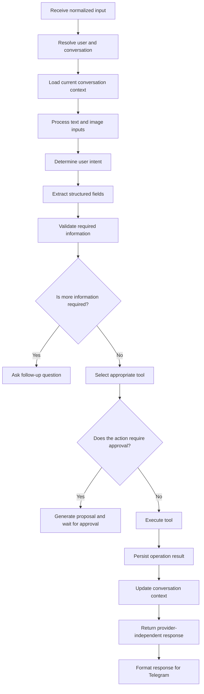
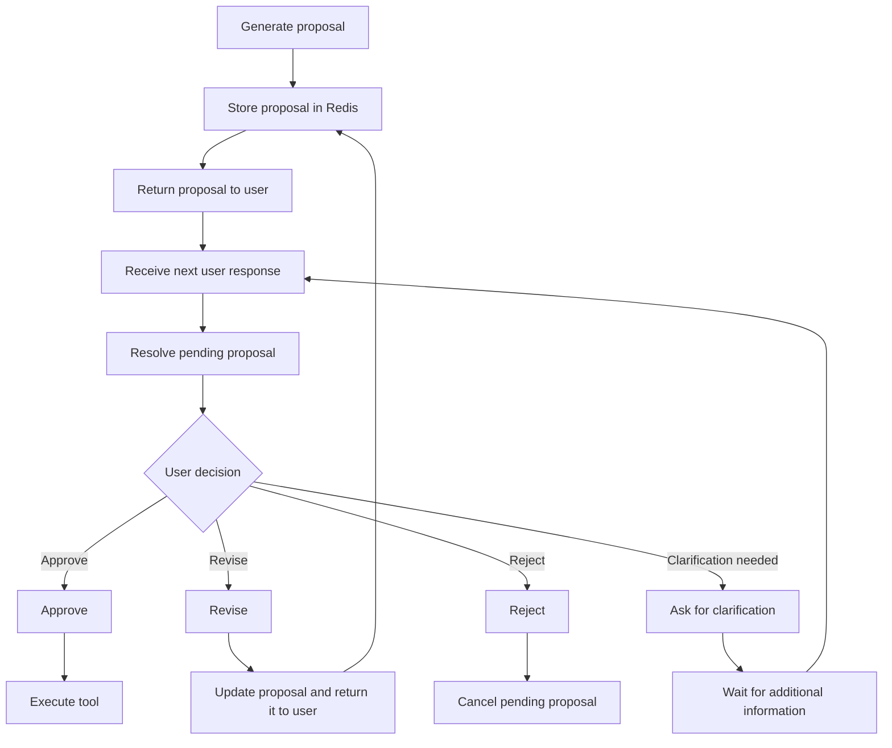

# Mango Agent — Product Requirements Document

**Version:** v1.0.0  
**Status:** Draft  
**Updated at:** July 12, 2026, 12:47 PM WIB  
**Product type:** Multi-user personal AI agent  
**Primary interface:** Telegram  
**Secondary interface:** Discord  
**Runtime architecture:** Python modular monolith  
**Deployment:** Docker Compose  
**Primary model provider:** Anthropic

---

## 1. Product Overview

Mango Agent is a multi-user personal AI agent designed to help users manage structured projects and tasks through natural-language conversations.

The first release focuses on project-management operations. Users interact with the agent primarily through Telegram using text messages and image attachments. The agent interprets user intent, checks whether sufficient information is available, prepares a structured task proposal, and presents it for human review before committing it to the database.

The agent manages its own internal task database rather than synchronizing with external task-management providers.

Mango Agent uses a single Python monorepo and a shared Docker image, but each Telegram or Discord bot instance runs as a separate Docker service. Inside each bot service, the channel adapter, configured agent, application services, and repository adapters communicate through direct in-process calls rather than an internal HTTP API. PostgreSQL, Redis, and Cloudflare R2 are shared infrastructure.

## 2. Product Vision

Build a flexible personal agent platform that can gradually expand beyond task management while retaining:

- A shared agent core
- Tool-based action execution
- Multi-user context isolation
- Multiple provider integrations
- Human oversight
- Extensible workflows
- Model-provider flexibility
- Modular-monolith architecture
- Replaceable ports and adapters
- Independent module testability

Task management is the first supported domain, not the final boundary of the product.

## 3. Version 1.0.0 Objective

Mango Agent v1.0.0 must allow multiple users to manage projects and tasks through Telegram using natural-language instructions.

The agent must be capable of:

- Creating projects and tasks
- Reading and retrieving projects and tasks
- Updating projects and tasks
- Deleting projects and tasks
- Validating task information
- Asking follow-up questions when required information is missing
- Generating a structured task proposal
- Requesting human approval before creating a task
- Accepting image attachments as supporting notes
- Returning stored task data and associated images
- Maintaining conversation context during the current conversation

## 4. Goals

### 4.1 Primary Goals

1. Provide natural-language task management through Telegram.
2. Support complete CRUD operations for projects and tasks.
3. Allow the agent to autonomously determine which tool should be used.
4. Ensure tasks are validated before database operations are performed.
5. Require human review before a new task is created.
6. Support multiple users with isolated task data and conversation state.
7. Support text and image-based input.
8. Store structured application data internally using PostgreSQL.
9. Run each configured Telegram or Discord bot instance in its own Python application runtime and Docker service, while reusing the same codebase and Docker image.
10. Provide tracing and agent observability through LangSmith.

### 4.2 Engineering Goals

1. Build Mango Agent as a modular monolith inside a single Python monorepo.
2. Use Hexagonal Architecture, also known as Ports and Adapters, to keep the application core independent from providers and infrastructure.
3. Separate communication-channel adapters from agent workflows and application logic.
4. Define a common agent interface and use a command-based agent registry. Each channel instance attaches its configured agent command, such as `task_management` or `job_management`, and the registry resolves that command directly to one agent implementation. The router must not use LLM intent classification to choose between agents.
5. Implement business operations as focused application services or use cases.
6. Keep PostgreSQL access behind domain-specific repository interfaces.
7. Use a Unit of Work for operations that require atomic changes across multiple repositories.
8. Use Redis through a dedicated conversation-state port rather than a generic database abstraction.
9. Use Cloudflare R2 through a dedicated attachment-storage port.
10. Construct concrete dependencies in a single composition root using dependency injection.
11. Use LangGraph to define agent execution flows.
12. Package and manage Python dependencies using `uv`.
13. Run each bot instance as an independent Docker Compose service, alongside shared PostgreSQL and Redis services. All bot services reuse the same Docker image and may be restarted independently.
14. Manage relational schema changes through versioned database migrations.
15. Ensure domain logic, use cases, agents, channels, repositories, and storage adapters can be tested independently.

## 5. Non-Goals for v1.0.0

The following are outside the scope of the first release:

- Image generation
- External task-provider synchronization
- Notion task synchronization
- Jira, Linear, Todoist, or GitHub Issues integration
- Long-term user memory
- Semantic search over historical conversations
- Voice input
- Voice output
- Autonomous task scheduling
- Recurring tasks
- Task dependency management
- Calendar integration
- Email integration
- Multi-agent orchestration
- Web dashboard
- Mobile application
- Advanced reporting and analytics
- Public or internal general-purpose HTTP API
- Microservice decomposition
- Message-broker-based communication between internal modules

## 6. Target Users

### 6.1 Primary User

An individual who wants to manage personal or collaborative tasks by messaging an AI agent.

### 6.2 Multi-User Behavior

Mango Agent must support multiple independent users.

Each request must be associated with an identifiable user. Task data, conversation context, projects, attachments, and tool actions must be scoped to that user unless the task is explicitly assigned to another known user.

User data from one conversation must not appear in another user's conversation.

## 7. Primary User Stories

### 7.1 Create a Task

As a user, I want to describe a task using natural language so that the agent can convert it into structured task data.

Example:

> Create a high-priority task for Dimas to fix the login error in the Mango project.

The agent should:

1. Interpret the instruction.
2. Extract available task fields.
3. Identify missing required information.
4. Ask follow-up questions when necessary.
5. Generate a structured task proposal.
6. Ask the user to approve, reject, or revise the proposal.
7. Create the task only after approval.

### 7.3 Retrieve Tasks

As a user, I want to ask for tasks using natural language.

Examples:

- Show my high-priority tasks.
- Show tasks in the Mango project.
- What tasks were completed today?
- Show the task assigned by Alex.
- Open the task containing the screenshot I sent earlier.

The agent should query the database and return matching tasks.

When a result contains an associated image, the agent should return both the task information and the image.

### 7.4 Update a Task

As a user, I want to update task properties through natural language.

Examples:

- Mark the login task as done.
- Change the priority to high.
- Assign this task to Alex.
- Add a note saying the bug only happens on Android.

The agent should identify the target task, validate the requested changes, and execute the update tool.

### 7.5 Delete a Task

As a user, I want to delete a task through natural language.

The agent must identify the correct task and request confirmation before executing deletion.

### 7.6 Manage Projects

As a user, I want to create, view, update, and delete projects so that tasks can be organized under project titles.

## 8. Core Domain Model

### 8.1 User

A user represents a person interacting with Mango Agent.

Minimum information:

- Internal user ID
- Provider
- Provider-specific user ID
- Display name
- Username, when available
- Created timestamp
- Updated timestamp

A single person may eventually have identities across multiple providers. Identity linking is not required for v1.0.0.

### 8.2 Project

A project groups related tasks.

Required project fields:

- Project ID
- Project title
- Owner user ID
- Created at
- Updated at

Additional project metadata may be introduced later.

### 8.3 Task

A task must support the following fields:

- Task ID
- Project ID
- Project title
- Task title
- Description
- Priority
- Tags
- Status
- Created at
- Updated at
- Done at
- Assigned by
- Assigned to
- Note

### 8.4 Field Requirements

#### Project title

Identifies the project associated with the task.

The agent must either:

- Match an existing project, or
- Propose creating a new project when no matching project exists

#### Task title

A concise title representing the intended action.

#### Description

A more detailed explanation of the task.

#### Priority

Represents the relative importance or urgency of the task.

The exact allowed priority values remain an open decision.

Proposed initial values:

- Low
- Medium
- High
- Urgent

#### Tags

A list of labels used for task grouping and filtering.

#### Status

Represents the task lifecycle state.

The exact allowed status values remain an open decision.

Proposed initial values:

- Todo
- In progress
- Blocked
- Done
- Cancelled

Human-review state should be represented by the agent workflow rather than necessarily being stored as the final task status.

#### Created at

Automatically generated when the task is created.

#### Updated at

Automatically updated whenever task information changes.

#### Done at

Set when the task enters a completed state.

It should be cleared when a completed task is moved back to a non-completed state.

#### Assigned by

Identifies the user who assigned or created the task.

#### Assigned to

Identifies the user responsible for the task.

#### Note

Stores additional user-provided context.

For image-supported tasks, the note must include relevant attachment information such as:

- Image reference
- Original filename
- Short image description
- Cloudflare R2 object key
- Any user-provided explanation

The raw image file must not be stored in PostgreSQL. PostgreSQL must store only relational attachment metadata and the stable Cloudflare R2 object key; temporary signed URLs must not be persisted.

### 8.5 Relational Persistence

PostgreSQL is the persistent source of truth for Mango Agent application data.

The initial relational model should include separate tables for:

- Users
- Provider identities
- Projects
- Tasks
- Attachments

Required relationships include:

- Each provider identity belongs to an internal user.
- Each project has an owner user.
- Each task belongs to a project.
- `assigned_by` and `assigned_to` reference internal users.
- Each attachment belongs to an uploader and may reference a task after approval.
- Attachment records store Cloudflare R2 metadata and object keys, not image binaries.

Foreign keys and database constraints must enforce referential integrity where appropriate. Persistent operations must pass through domain services and repository interfaces rather than being executed directly by the agent.

## 9. Agent Behavior

### 9.1 Autonomous Decision-Making

The agent is autonomous in deciding:

- The user's intent
- Which task operation is required
- Which tool should be called
- Whether required information is missing
- Whether a follow-up question is required
- How unstructured input should be transformed into structured task fields

The agent must not silently invent important task information.

When required information cannot be safely inferred, the agent must ask a follow-up question.

### 9.2 Human-in-the-Loop Creation Flow

All task-creation operations must pass through human review.

The agent must present a task proposal containing the extracted task data.

The user must be able to:

- Approve the proposal
- Reject the proposal
- Request changes
- Provide missing information

The task-creation tool must only be executed after explicit user approval.

### 9.3 Human Review Example

```plain text
Task proposal

Project: Mango Agent
Title: Add Telegram message handler
Description: Implement the Telegram long-polling handler and route normalized messages to the task agent.
Priority: High
Tags: telegram, agent
Status: Todo
Assigned by: Dimas
Assigned to: Dimas
Note: Screenshot attached

Create this task?
```

Supported responses should include natural-language equivalents of:

- Approve
- Create it
- Confirm
- Change the priority
- Add another note
- Cancel

### 9.4 Follow-Up Questions

A follow-up question should be asked when:

- The intended project cannot be determined
- The task title cannot be derived
- The target task for an update or deletion is ambiguous
- The intended assignee is unclear
- The image does not contain enough usable context
- The user provides conflicting task information
- The requested action cannot be mapped to a supported operation

Questions should request only the information needed to continue.

### 9.5 Read Operations

Read operations do not require approval.

The agent may immediately execute search and retrieval tools after interpreting the user's request.

### 9.6 Update Operations

Updates may be executed autonomously after the target task and requested changes are unambiguous.

Confirmation is required when an update has significant destructive effects, such as replacing substantial content or changing task ownership.

### 9.7 Delete Operations

Delete operations must require explicit confirmation before execution.

## 10. Conversation Context

Mango Agent v1.0.0 will maintain current-conversation context.

Conversation context should allow the agent to understand references such as:

- This task
- The previous project
- Assign it to me
- Use the image I just sent
- Change its priority
- Create the task now

Redis will store active conversation state.

The conversation state may contain:

- User identity
- Provider identity
- Recent messages
- Pending task proposal
- Pending confirmation
- Last referenced task
- Last referenced project
- Temporary attachment references
- Current LangGraph execution state

Long-term conversation memory is not included in v1.0.0.

## 11. Image Input Requirements

### 11.1 Supported Behavior

The system must accept image attachments alongside text instructions.

Images may be used as:

- Supporting evidence
- Screenshots of issues
- Visual notes
- Context for task descriptions
- References returned with task results

### 11.2 Storage

Images will be stored in a private Cloudflare R2 bucket.

The storage implementation must:

- Generate a unique object key
- Prevent filename collisions
- Preserve the original filename in attachment metadata when available
- Record MIME type
- Record file size
- Associate the object with a user
- Associate the object with a task after approval
- Keep the R2 bucket private
- Prevent one user from accessing another user's images
- Generate a short-lived presigned URL only after authorization
- Delete abandoned temporary objects after rejection or expiration
- Never store raw image data or temporary presigned URLs in PostgreSQL

### 11.3 Image Metadata

Although user-visible image information may be added to the task's `note` field, attachment metadata must be stored separately for reliable authorization, storage, and retrieval.

Recommended internal metadata:

- Attachment ID
- Task ID
- User ID
- Storage provider (`cloudflare_r2`)
- Bucket name
- Object key
- Original filename
- MIME type
- File size
- Upload status
- Created at
- Updated at

The R2 object key is the stable storage reference. A presigned URL is temporary and must be generated only when an authorized user requests the image.

### 11.4 Image Output

Mango Agent will not generate images.

It may return previously uploaded images associated with a task.

Before returning an image, the backend must verify that the requesting user is authorized to access the attachment. It must then generate a short-lived Cloudflare R2 presigned URL or retrieve the object through the R2 API for provider delivery.

## 12. Telegram Integration

Telegram is the primary provider for v1.0.0.

The Telegram adapter must:

- Receive text messages through long polling for v1.0.0
- Receive image attachments
- Identify the Telegram user
- Map the Telegram user to an internal Mango Agent user
- Convert provider-specific input into the normalized internal request
- Call the selected agent directly within the Python application process
- Display follow-up questions
- Display task proposals
- Receive approval or rejection
- Return task query results
- Return associated images
- Handle provider-specific message formatting

Telegram-specific logic must remain outside the core agent workflow.

The core agent should receive a normalized provider-independent request.

```json
{
  "provider": "telegram",
  "provider_user_id": "123456789",
  "conversation_id": "123456789",
  "message_id": "987654321",
  "text": "Create a task from this screenshot",
  "attachments": [
    {
      "type": "image",
      "storage_id": "attachment-id"
    }
  ]
}
```

### 12.1 Discord

Discord support is part of the broader architecture but is secondary for v1.0.0.

The Discord adapter should eventually reuse the same normalized request and response contracts as Telegram.

Full Discord feature parity is not required for the initial release unless added later to the v1.0.0 scope.

## 13. Agent Workflow

The primary LangGraph workflow should follow this sequence:



### 13.1 Pending Approval Flow



## 14. Tool Requirements

The agent must use explicit tools for database operations.

The model must not directly modify PostgreSQL.

Agent tools must call domain services, and domain services must access persistent data through repository interfaces.

### 14.1 Project Tools

- Create project
- Get project
- Search projects
- Update project
- Delete project

### 14.2 Task Tools

- Create task
- Get task
- Search tasks
- Update task
- Delete task

### 14.3 Attachment Tools

- Upload image to Cloudflare R2
- Get image metadata
- Generate presigned image URL
- Retrieve image
- Associate image with task
- Delete R2 object
- Delete unassigned temporary image

### 14.4 User Tools

- Resolve provider user
- Get user
- Search known users for assignment

### 14.5 Tool Contract Requirements

Each tool must:

- Accept structured input
- Return structured output
- Validate the acting user
- Enforce user-level data isolation
- Return actionable errors
- Avoid exposing internal database objects directly
- Be independently testable
- Be callable from LangGraph
- Be reusable by future MCP servers or API consumers

## 15. Architecture and Design Patterns

Mango Agent will use a modular monolith with Hexagonal Architecture.

The application is divided into a stable core and replaceable adapters.

### 15.1 Dependency Direction

```plain text
Channel Adapters
        ↓
Agent Router and Agent Strategies
        ↓
Application Services / Use Cases
        ↓
Domain Models and Ports
        ↑
Infrastructure Adapters
```

Inner layers must not import Telegram, Discord, PostgreSQL, Redis, Cloudflare R2, or model-provider implementations.

### 15.2 Channel Adapters

Telegram and Discord are inbound adapters.

Each channel must convert provider-specific events into a normalized internal message and convert provider-independent results back into provider-specific output.

Agent workflows must not receive Telegram or Discord SDK objects.

### 15.3 Agent Strategy and Router

Different agents must implement a common agent contract.

Initial and future implementations may include:

- Task-management agent
- Job-scraper agent
- General personal-assistant agent

An agent router or registry selects the correct agent based on channel configuration, commands, or interpreted intent. Routing logic must not be duplicated across channel adapters.

### 15.4 Application Services

Business operations must be implemented as focused use cases such as:

- Create task
- Approve task proposal
- Update task
- Delete task
- Search tasks
- Upload attachment

Agents may select and invoke use cases, but must not contain persistence logic or raw infrastructure calls.

### 15.5 Repository Pattern

Repository interfaces must be domain-specific and defined by the application core.

PostgreSQL repository implementations live in the infrastructure layer.

Repositories must expose meaningful domain operations rather than a universal generic CRUD abstraction.

### 15.6 Storage Ports

Different storage technologies require separate contracts:

- PostgreSQL repositories for persistent relational entities
- Redis conversation store for temporary workflow state
- Cloudflare R2 attachment storage for image objects

These technologies must not be hidden behind one generic database interface.

### 15.7 Unit of Work

Operations that modify multiple relational aggregates must use a Unit of Work so they can commit or roll back atomically.

Examples include creating a task and associating approved attachments in the same transaction.

### 15.8 Dependency Injection and Composition Root

Concrete implementations must be constructed in one application bootstrap or composition root.

Application services and agents receive dependencies through their constructors rather than creating database, Redis, R2, or model clients internally.

### 15.9 Future MCP Support

MCP remains a future adapter option. The existing ports and application services should be reusable by a future MCP server without changing domain logic.

## 16. Runtime and Internal Communication

Mango Agent does not require a general-purpose HTTP API for v1.0.0.

All application modules run from the same monorepo and communicate through Python interfaces and direct method calls.

### 16.1 Application Runtime

The initial runtime consists of:

- Telegram polling adapter
- Optional Discord gateway adapter
- Agent router and agent implementations
- Application services
- Domain models and ports
- PostgreSQL repositories
- Redis conversation-state adapter
- Cloudflare R2 attachment adapter
- Background cleanup tasks

### 16.2 Internal Request Contract

Channel adapters must produce a provider-independent request containing:

- Provider identity
- Provider user ID
- Conversation ID
- Message ID
- Text
- Attachment references

### 16.3 Internal Response Types

Agents and application services may return:

- Final text response
- Follow-up question
- Task proposal
- Confirmation request
- Tool or use-case result
- Task list
- Task details
- Attachment reference
- Error response

### 16.4 Docker Services

The initial Docker Compose deployment should contain:

```plain text
mango-app
postgres
redis
```

Cloudflare R2 and the model provider remain external managed services.

Telegram, Discord, agents, services, and repositories remain internal modules inside the `mango-app` container.

A future public API may be added as another inbound adapter, but it is not required for v1.0.0.

## 17. Technical Architecture

### 17.1 Core Stack

- Python
- `uv`
- LangChain
- LangGraph
- LangSmith
- Anthropic models
- PostgreSQL
- Redis
- Cloudflare R2
- Docker Compose

### 17.2 Component Overview

```plain text
Telegram Adapter ─┐
Discord Adapter  ─┼─→ Normalized Message
Future Adapter   ─┘
                         ↓
                    Agent Router
                         ↓
             Agent Strategy Implementations
                         ↓
                Application Services
                         ↓
                  Domain Models / Ports
                         ↓
                 Repository / Storage Ports
                    ├── PostgreSQL
                    ├── Redis
                    └── Cloudflare R2
```

### 17.3 Component Responsibilities

#### Channel Adapters

- Receive provider events
- Normalize messages and attachments
- Resolve provider-specific identifiers
- Call agents directly in process
- Format provider-specific responses

#### Agent Router

- Select the configured or intended agent
- Keep routing logic independent from channels
- Reject unsupported agent selections with actionable errors

#### Agent Implementations

- Interpret user intent
- Select tools or application use cases
- Manage agent-specific LangGraph workflows
- Return provider-independent responses
- Avoid direct persistence access

#### Application Services

- Coordinate business use cases
- Enforce authorization and workflow rules
- Manage transaction boundaries through Unit of Work
- Call repositories and external-service ports

#### Domain Layer

- Entities and value objects
- Business invariants
- Domain-specific repository interfaces
- Storage and model-provider ports

#### Repository Layer

- PostgreSQL data-access implementations
- User-scoped queries
- Domain-to-persistence mapping
- Transaction support

#### Redis Adapter

- Current conversation context
- Pending task proposals
- Pending confirmations
- Temporary attachment state
- Short-lived workflow state

#### Cloudflare R2 Adapter

- Private image objects
- Stable object keys
- Authorized short-lived presigned URLs
- Temporary-object cleanup

#### Composition Root

- Initialize concrete infrastructure clients
- Construct repositories, services, agents, and channel adapters
- Own application startup and graceful shutdown

## 18. Data Ownership, Isolation, and Testability

### 18.1 Data Ownership and Isolation

Every persistent entity must include ownership or access information.

At minimum:

- Projects must be associated with an owner.
- Tasks must be associated with a project and relevant users.
- Attachments must be associated with an uploader and task.
- Queries must be scoped to the current user's authorized data.
- Provider user IDs must not be used as globally trusted authorization values without internal identity resolution.

An assigned user may be allowed to view tasks assigned to them even when another user created the task.

The exact collaboration and visibility model remains an open decision.

### 18.2 Independent Testing Strategy

The architecture must allow each layer to be tested independently.

Required test levels:

1. Domain unit tests without infrastructure.
2. Application-service tests using in-memory repositories and fake ports.
3. Agent tests using fake tools or use cases and deterministic model responses.
4. Channel-adapter tests using provider event fixtures and fake agents.
5. Repository contract tests against PostgreSQL.
6. Redis and Cloudflare R2 adapter integration tests.
7. A limited set of Docker-based end-to-end tests.

Application services, agents, and channel adapters must receive dependencies through injection. They must not construct concrete PostgreSQL, Redis, R2, or model-provider clients internally.

## 19. Release Summary

Mango Agent v1.0.0 is a multi-user personal task-management agent built as a Python modular monolith.

It uses Anthropic models with LangChain and LangGraph to interpret text and image-supported requests, manage temporary conversation state, prepare structured project and task operations, and execute those operations through explicit tools.

Telegram is the primary user interface. Mango Agent runs as a Dockerized Python modular monolith in a single monorepo. Channel adapters invoke agent workflows and application services directly in process. PostgreSQL is the persistent source of truth for users, projects, tasks, and attachment metadata; Redis manages active workflow state; Cloudflare R2 stores uploaded images; and LangSmith provides agent observability.

The defining behavior of the first release is autonomous task preparation combined with human approval before task creation.

## 20. Initial Repository Folder Structure

The following folders define the initial Hexagonal Architecture boundaries. Individual filenames can be added later as each feature is implemented.

| Folder | Purpose |
| --- | --- |
| `src/` | Contains all application source code. |
| `mango_agent/` | The root Python package for Mango Agent. |
| `bootstrap/` | Creates concrete dependencies, wires repositories and services together, and starts the application. |
| `channels/` | Contains inbound adapters that receive provider events and convert them into provider-independent messages. |
| `channels/telegram/` | Handles Telegram long polling, incoming messages and images, and Telegram-formatted responses. |
| `channels/discord/` | Handles Discord events and responses when Discord support is enabled. |
| `agents/` | Contains agent workflows, routing, intent handling, and tool selection. |
| `agents/task_management/` | Contains the task-management agent and its LangGraph workflow. |
| `modules/` | Contains Mango Agent's business domains. Each module owns its rules, use cases, ports, and adapters. |
| `modules/identity/` | Resolves provider identities and manages internal users. |
| `modules/task_management/` | Manages projects, tasks, assignments, statuses, and task operations. |
| `modules/attachments/` | Manages attachment metadata, authorization, uploads, retrieval, and Cloudflare R2 storage. |
| `modules/conversation/` | Manages temporary conversation context, pending proposals, and Redis-backed state. |
| `domain/` | Contains pure business entities, value objects, validation rules, and domain exceptions. |
| `application/` | Contains use cases that coordinate domain rules, repositories, transactions, and external ports. |
| `ports/` | Defines interfaces required by the application, such as repositories, Unit of Work, state storage, and object storage. |
| `adapters/` | Contains concrete implementations of ports using PostgreSQL, Redis, Cloudflare R2, or another provider. |
| `integrations/` | Contains shared external integrations such as Anthropic and LangSmith. |
| `shared/` | Contains small reusable components shared by multiple modules. It should not become a dumping ground for domain logic. |
| `tests/` | Contains all automated tests. |
| `tests/unit/` | Tests domain rules, use cases, and agents without real infrastructure. |
| `tests/integration/` | Tests PostgreSQL, Redis, Cloudflare R2, and other concrete integrations. |
| `tests/contract/` | Verifies that adapter implementations satisfy their port contracts. |
| `tests/end_to_end/` | Tests a limited number of complete user flows. |
| `migrations/` | Stores versioned PostgreSQL schema migrations. |
| `scripts/` | Stores development, maintenance, cleanup, and operational utility commands. |
| `docker/` | Stores Docker-related startup and deployment support files. |

The initial monorepo should use the following folder structure. Only directories required for the first implementation are included; additional agents and adapters should be added when their functionality is introduced.

```plain text
mango-agent/
├── src/
│   └── mango_agent/
│       ├── bootstrap/
│       ├── channels/
│       │   ├── telegram/
│       │   └── discord/
│       ├── agents/
│       │   └── task_management/
│       ├── modules/
│       │   ├── identity/
│       │   │   ├── domain/
│       │   │   ├── application/
│       │   │   ├── ports/
│       │   │   └── adapters/
│       │   ├── task_management/
│       │   │   ├── domain/
│       │   │   ├── application/
│       │   │   ├── ports/
│       │   │   └── adapters/
│       │   ├── attachments/
│       │   │   ├── domain/
│       │   │   ├── application/
│       │   │   ├── ports/
│       │   │   └── adapters/
│       │   └── conversation/
│       │       ├── domain/
│       │       ├── application/
│       │       ├── ports/
│       │       └── adapters/
│       ├── integrations/
│       │   └── llm/
│       └── shared/
│           ├── domain/
│           └── infrastructure/
├── migrations/
├── tests/
│   ├── unit/
│   ├── integration/
│   ├── contract/
│   ├── end_to_end/
│   └── fakes/
├── scripts/
└── docker/
```

Each business module follows the same Hexagonal Architecture boundary:

```plain text
domain → application → ports ← adapters
```

## Command-Based Agent Routing and Bot Deployment

### Command-Based Agent Selection

Each Telegram or Discord bot instance is assigned to exactly one agent.

The channel adapter must attach an internal agent command to every normalized message, for example:

```plain text
agent_command: task_management
```

or:

```plain text
agent_command: job_management
```

The agent router is a deterministic registry lookup:

```plain text
task_management → Task Management Agent
job_management → Job Management Agent
```

The router must not inspect natural-language intent or use an LLM to choose between agents. The channel instance already knows which agent it belongs to and supplies the configured command directly.

A user-facing slash command may also be supported, but it is optional. The required routing signal is the internal command attached by the configured channel instance.

### Docker Service Boundary

Mango Agent uses one monorepo and one reusable Docker image, but each bot instance runs as a separate Docker Compose service.

Example deployment with two Telegram bots and two Discord bots:

```plain text
mango-task-telegram
mango-job-telegram
mango-task-discord
mango-job-discord
postgres
redis
```

Each bot service:

- Runs one channel instance
- Uses one configured agent command
- Constructs only the selected agent and its dependencies
- Calls the agent and application use cases directly in process
- Connects independently to shared PostgreSQL, Redis, and Cloudflare R2
- Has its own logs, health state, restart policy, and failure boundary

All bot services reuse the same source code and Docker image with different environment variables, such as:

```plain text
CHANNEL=telegram
BOT_INSTANCE=task-telegram
AGENT_COMMAND=task_management
```

If one bot service crashes or loses its connection, only that bot instance is restarted. The remaining Telegram and Discord bot services continue running.

Database migrations and scheduled maintenance must not run independently in every bot container. They should run through a dedicated migration or worker service when required.
