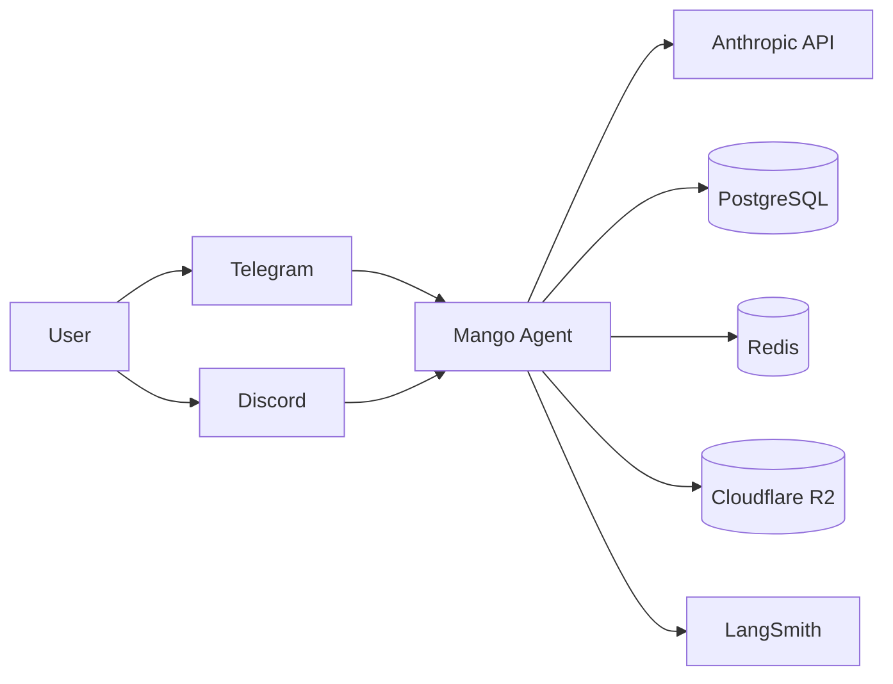
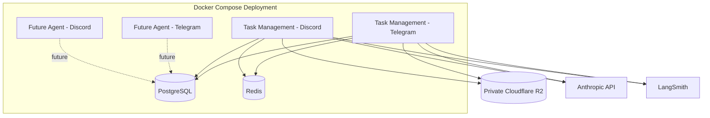
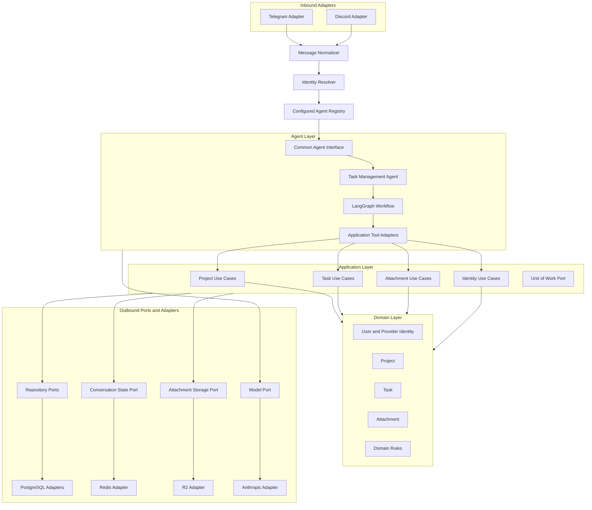
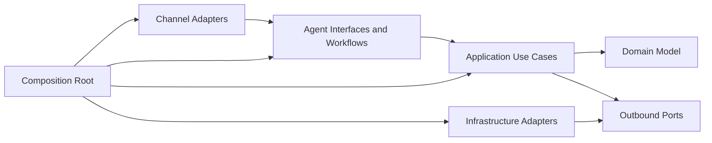
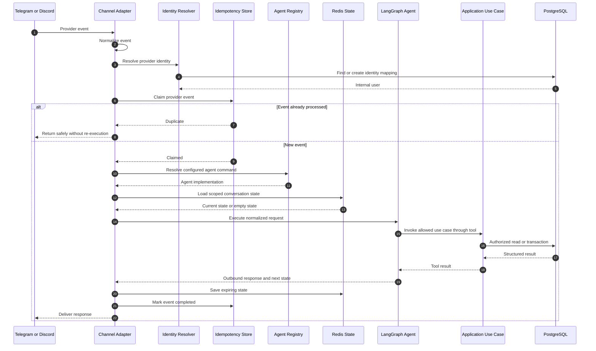
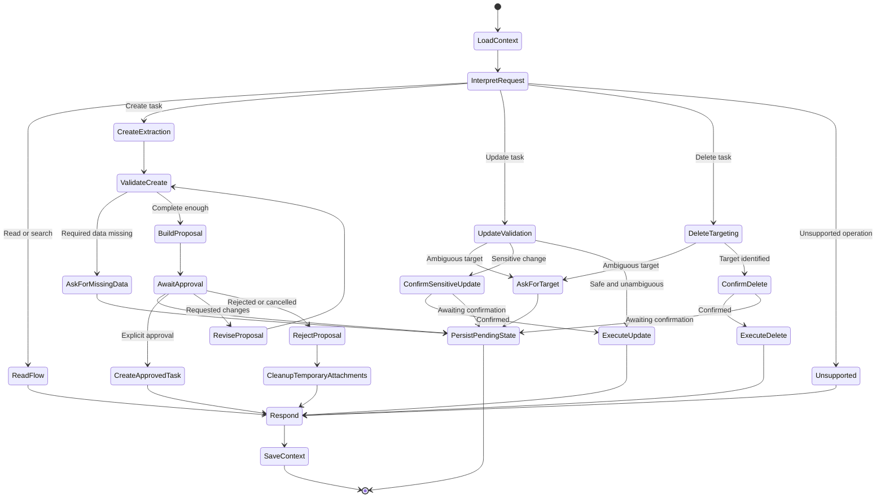
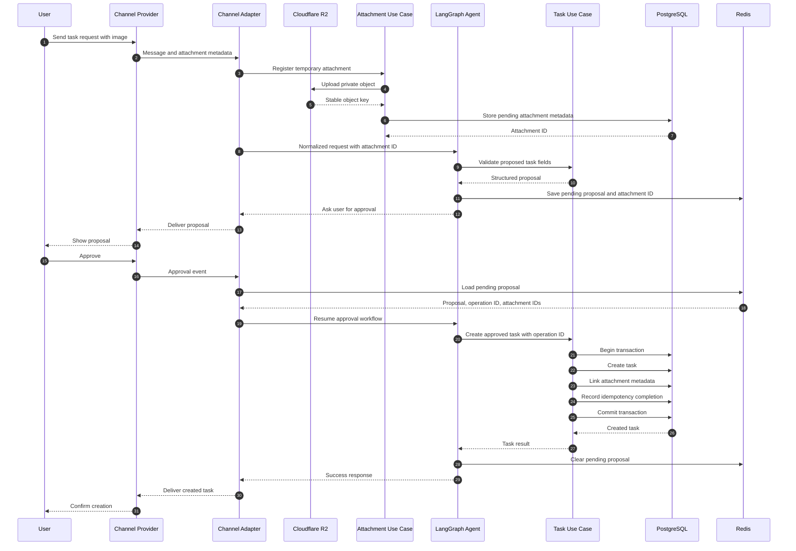
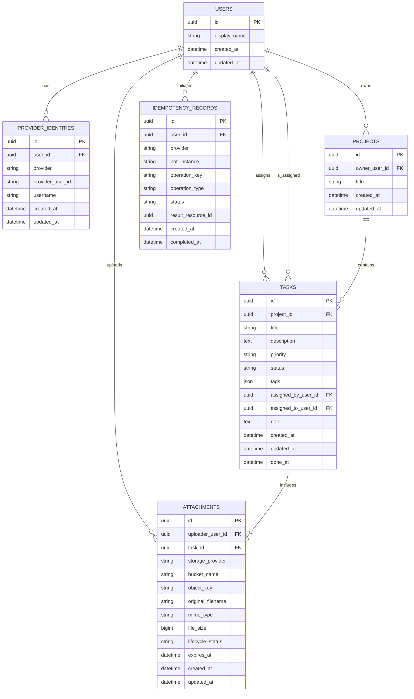
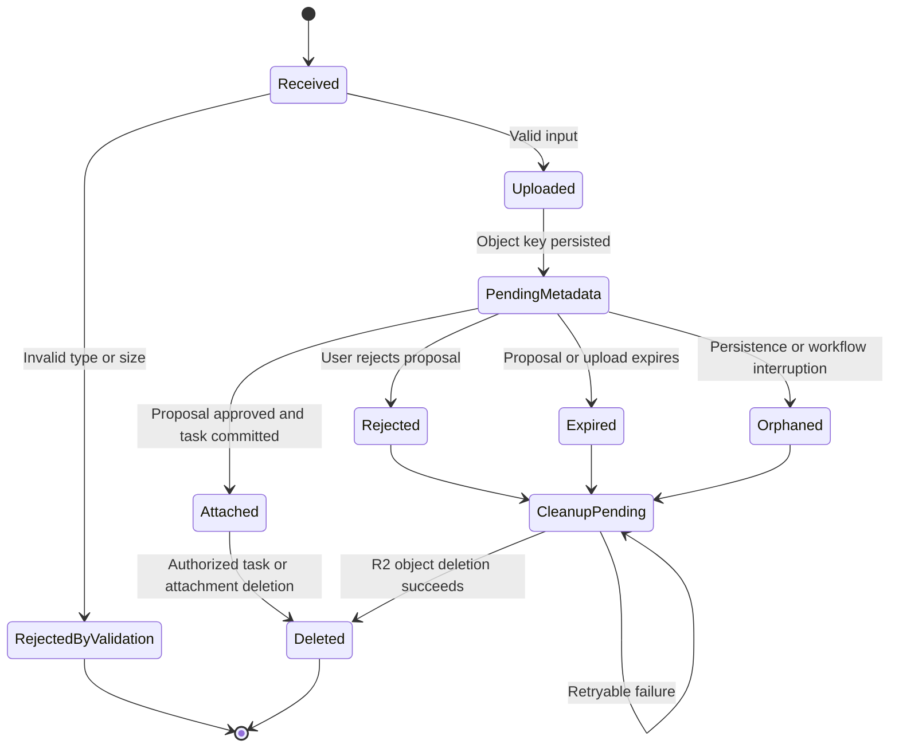

# Mango Agent System Design Document

**Document version:** v0.3.0  
**Product version:** Mango Agent v1.0.0  
**Status:** Draft  
**Updated at:** July 12, 2026  
**Related document:** Mango Agent Product Requirements Document  
**Reading guide:** Read the one-sentence "Simple example" first. Then read the technical details only when you need them.

---

## 1. Executive Summary

> **Simple example:** Dimas sends, "Create a task to fix the login error," with a screenshot. Mango shows the task first and saves it only after Dimas says yes.

Mango Agent is a multi-user personal AI agent that allows users to manage projects and tasks through natural-language conversations. Telegram is the primary channel for v1.0.0, while Discord is supported through the same channel abstraction.

The system will be implemented as a **Python modular monolith in a single monorepo**. Every configured channel-agent combination runs as an independent Docker Compose service, but all bot services reuse the same source code and Docker image. Components inside one bot service communicate through direct in-process calls; Mango Agent does not expose or require an internal general-purpose HTTP API in v1.0.0.

The application core follows **Hexagonal Architecture (Ports and Adapters)**. Channel providers, model providers, PostgreSQL, Redis, Cloudflare R2, and observability tools are external adapters around independently testable domain and application modules.

Core infrastructure:

- PostgreSQL for durable relational application data
- Redis for temporary conversation and LangGraph workflow state
- Cloudflare R2 for private image storage
- Anthropic as the primary model provider
- LangGraph for agent workflow execution
- LangSmith for tracing and agent observability
- Docker Compose for local and initial production deployment
- Versioned database migrations for schema evolution

The most important design guarantees are:

1. Every operation is scoped to an authenticated internal user.
2. Task creation requires explicit human approval.
3. Task deletion requires explicit confirmation.
4. Agents cannot access infrastructure directly; they invoke application use cases through tools.
5. Duplicate provider events and duplicate approvals must not create duplicate records.
6. Raw images and temporary presigned URLs are never stored in PostgreSQL.

---

## 2. Scope

> **Simple example:** Mango can create, show, update, and delete tasks. It cannot send calendar reminders or sync tasks to Jira in version 1.

### 2.1 Included in v1.0.0

- Telegram text and image input through long polling
- A reusable Discord channel adapter boundary
- Multi-user provider identity resolution
- Project CRUD
- Task CRUD
- Natural-language task search and filtering
- Structured task proposal generation
- Human approval before task creation
- Confirmation before task deletion
- Current-conversation context
- Image upload, association, authorization, and retrieval
- PostgreSQL persistence
- Redis-backed temporary state
- Cloudflare R2 object storage
- LangGraph workflows
- LangSmith traces
- Independent Docker services for configured bot instances

### 2.2 Excluded from v1.0.0

- Public or internal general-purpose HTTP API
- Microservice decomposition
- Message-broker-based internal communication
- Multi-agent orchestration
- LLM-based routing between agent types
- External task-provider synchronization
- Long-term user memory
- Semantic search over historical conversations
- Voice input or output
- Calendar or email integration
- Autonomous scheduling and recurring tasks
- Task dependencies
- Web or mobile applications
- Advanced analytics

---

## 3. Requirements and Design Mapping

> **Simple example:** One message can use several parts of the system: Telegram receives it, R2 stores the image, Redis remembers the draft, and PostgreSQL saves the approved task.

| Product requirement | Design response |
| --- | --- |
| Multi-user task management | Internal users and provider identities with mandatory authorization scope |
| Telegram-first interface | Telegram adapter normalizes provider events into channel-independent messages |
| Discord extensibility | Common channel port and normalized inbound/outbound message contracts |
| Human-reviewed task creation | LangGraph proposal state pauses until explicit approval, revision, or rejection |
| Current-conversation context | Redis conversation state with expiration |
| Image-supported tasks | Private R2 objects plus relational attachment metadata |
| Independent bot runtimes | One Docker service per configured channel-agent combination |
| Shared codebase | One monorepo and reusable Docker image |
| No internal API | Direct in-process calls between adapters, agents, use cases, and ports |
| Replaceable infrastructure | Hexagonal ports for repositories, state, storage, model, and tracing |
| Reliable database changes | Unit of Work and versioned migrations |
| Testable agent behavior | Explicit graph states, deterministic adapter fakes, and contract tests |

---

## 4. Architecture Principles

> **Simple example:** The AI decides what Dimas wants, but it is not allowed to write directly to the database. A normal application service does that safely.

### 4.1 Modular monolith

Mango Agent is deployed as multiple processes but developed as one modular application. A module owns its behavior and contracts, while infrastructure implementations remain replaceable.

### 4.2 Dependency inversion

The application core defines ports. Provider and infrastructure modules implement them. Domain and application modules must not import Telegram, Discord, PostgreSQL drivers, Redis clients, R2 SDKs, Anthropic SDKs, or LangSmith-specific code.

### 4.3 Explicit user scope

Every use case receives an authenticated execution context. Repository reads and writes are scoped by the internal user or by an explicitly evaluated collaboration rule. User scope must not be inferred from model output.

### 4.4 Human control for irreversible operations

Creation and deletion are modeled as workflows, not one-shot tool calls. A proposal or confirmation token must be tied to the user, conversation, operation, and expiration time.

### 4.5 Durable business data, temporary workflow state

PostgreSQL is the source of truth for users, provider identities, projects, tasks, attachments, and idempotency records. Redis stores expiring context and workflow checkpoints only.

### 4.6 Configuration-based agent selection

A bot service is configured with one agent command such as `task_management`. The agent registry resolves that command to a concrete agent implementation without an LLM deciding which agent type should run.

---

## 5. Key Architecture Decisions

> **Simple example:** The Telegram bot and Discord bot use the same code, but either bot can restart without stopping the other one.

| Decision | Selected approach | Rationale |
| --- | --- | --- |
| Code organization | Single Python monorepo | Shared core, atomic refactoring, and simpler dependency management |
| Application style | Modular monolith | Strong boundaries without distributed-system overhead |
| Runtime isolation | One service per channel-agent configuration | Independent credentials, restart, scaling, and failure isolation |
| Internal communication | Direct in-process calls | No network boundary exists inside one bot runtime |
| Application architecture | Hexagonal Architecture | Keeps business behavior independent from providers |
| Agent workflow | LangGraph | Explicit state transitions, pause/resume, and checkpoint support |
| Agent selection | Command-based registry | Deterministic and cheaper than LLM routing |
| Persistent database | PostgreSQL | Transactions, relational integrity, and flexible filtering |
| Temporary state | Redis | Expiration and fast workflow checkpoint access |
| Object storage | Private Cloudflare R2 bucket | Durable image storage without storing binaries in PostgreSQL |
| Transaction boundary | Unit of Work | Atomic changes across related repositories |
| Initial deployment | Docker Compose | Matches v1 operational scope and independent bot processes |

---

## 6. System Context

> **Simple example:** Dimas talks to Telegram. Mango talks to the AI model, database, Redis, and image storage for him.

Mango Agent trusts provider-authenticated event metadata to identify the provider account, then maps that identity to an internal user before any application operation is allowed.

---

## 7. Runtime and Deployment Architecture

> **Simple example:** If the Telegram bot crashes, Docker restarts only the Telegram bot. The Discord bot and database keep running.

Each configured bot instance runs as an independent application process. The service selects one channel adapter and one configured agent command during startup. All bot services share PostgreSQL, Redis, and R2, but isolation is enforced in application queries and state keys.

### 7.1 Runtime configuration categories

Every bot service requires configuration for:

- Channel provider and bot credentials
- Configured agent command
- Model provider and model selection
- PostgreSQL connection
- Redis connection and state expiration policies
- R2 bucket and credentials
- LangSmith tracing
- Logging and environment mode

Concrete configuration names are intentionally left to implementation because no repository configuration contract exists yet.

### 7.2 Startup behavior

A bot service must fail fast when required configuration is missing or invalid. Startup composes concrete adapters in one composition root and verifies connectivity needed for safe operation before accepting messages.

---

## 8. Internal Component Architecture

> **Simple example:** For "Mark the login task as done," Telegram reads the message, the task agent understands it, and the task service updates the database.

### 8.1 Module responsibilities

**Channel adapters**

- Receive provider events
- Download or stream provider attachments when needed
- Produce normalized inbound messages
- Deliver normalized outbound responses
- Preserve provider event IDs for idempotency
- Contain no task-management business rules

**Identity module**

- Resolve a provider identity to an internal user
- Create the initial mapping when permitted
- Produce an authenticated execution context
- Prevent provider metadata from being overridden by model output

**Agent module**

- Interpret user intent within the configured domain
- Select allowed domain tools
- Ask focused follow-up questions
- Control proposal, approval, revision, and confirmation states
- Never access SQL, Redis, or R2 clients directly

**Application module**

- Implement use cases
- Enforce authorization and validation
- Coordinate repositories and storage ports
- Define transaction boundaries
- Return structured results independent of the channel provider

**Domain module**

- Represent users, projects, tasks, and attachments
- Enforce lifecycle invariants
- Contain no provider or database dependencies

**Infrastructure module**

- Implement repository, state, storage, model, and tracing adapters
- Translate infrastructure errors into application-level errors

---

## 9. Dependency Rules

> **Simple example:** The agent asks the task service to update a task. It does not run an SQL command by itself.

Rules:

1. Domain code depends on no infrastructure framework.
2. Application use cases depend on domain types and ports.
3. Agent tools depend on application use cases, not concrete repositories.
4. Channel adapters depend on the common agent interface, not concrete agent internals.
5. Infrastructure adapters implement ports defined toward the core.
6. Only the composition root selects concrete implementations.
7. Cross-module imports must use public module contracts.

---

## 10. Normalized Message Contracts

> **Simple example:** Telegram and Discord messages are changed into the same simple message format before the agent reads them.

The channel boundary should use provider-independent concepts.

### 10.1 Inbound message

Recommended fields:

- Provider name
- Bot instance identifier
- Provider event identifier
- Provider conversation identifier
- Provider thread identifier when available
- Provider user identifier
- Display name and username when available
- Message identifier
- Text content
- Attachment descriptors
- Reply-to message reference when available
- Received timestamp

### 10.2 Outbound response

Recommended capabilities:

- Text response
- Image or attachment response
- Provider-supported approval actions when available
- Reply-to message reference
- Provider delivery metadata

These are logical contracts. Exact Python types and module locations will be defined during implementation.

---

## 11. General Message Processing Flow

> **Simple example:** When Dimas sends a message, Mango checks who sent it, checks it is not a duplicate, runs the task flow, and sends a reply.

A durable idempotency claim is preferred for operations that can mutate business data. A temporary cache alone is insufficient when a duplicate event could arrive after cache expiration.

---

## 12. Agent and LangGraph Design

> **Simple example:** If Dimas says "Create a task," Mango gathers the details, shows a draft, waits for "Yes," and then creates it.

### 12.1 Graph state

The workflow state should include:

- Authenticated execution context
- Normalized current message
- Recent bounded conversation context
- Detected task operation
- Extracted structured fields
- Validation errors or missing fields
- Pending proposal
- Pending confirmation
- Last referenced project
- Last referenced task
- Temporary attachment IDs
- Tool results
- Retry and graph-step counters

### 12.2 Task-management workflow

### 12.3 Tool boundaries

Tools exposed to the task-management agent should represent application use cases rather than low-level infrastructure operations. Logical tool groups include:

- Project creation, retrieval, update, and deletion
- Task proposal validation
- Approved task creation
- Task search and retrieval
- Task update and completion
- Confirmed task deletion
- Attachment registration, linking, and retrieval authorization
- Known-user and assignee resolution

The approved task-creation use case must independently verify approval state. The model must not be able to bypass approval by calling a raw create repository method.

### 12.4 Step and retry limits

The graph must enforce:

- Maximum model turns per inbound provider message
- Maximum tool calls per execution
- Bounded repair attempts for invalid structured arguments
- Explicit terminal handling when limits are reached

Exact limits remain an operational configuration decision and should be tuned through LangSmith traces.

---

## 13. Task Creation with Image and Human Approval

> **Simple example:** Dimas sends a screenshot with a task. Mango keeps the image temporary until he approves the task.

### 13.1 Approval invariants

An approval is valid only when all conditions are true:

- It belongs to the same internal user.
- It belongs to the same bot and conversation scope.
- It references the active proposal or operation identifier.
- It has not expired.
- It has not already been consumed.
- The proposal content has not changed after approval.

Revision creates a new proposal version and invalidates approval for the previous version.

---

## 14. Application Use Cases

> **Simple example:** "Show my urgent tasks" runs the search-tasks action. "Mark this done" runs the update-task action.

### 14.1 Identity

- Resolve provider identity
- Create an internal user and identity mapping when permitted
- Retrieve a known user for assignment
- Evaluate whether the actor may reference or assign another user

### 14.2 Projects

- Create project
- Retrieve project
- Search and list projects
- Update project
- Delete project after dependency checks

### 14.3 Tasks

- Validate task proposal
- Create approved task
- Retrieve task
- Search and filter tasks
- Update task fields
- Transition task status
- Complete or reopen task
- Delete confirmed task

### 14.4 Attachments

- Register a pending upload
- Store private object metadata
- Link attachment to an approved task
- Authorize attachment retrieval
- Generate short-lived access or retrieve object for provider delivery
- Reject or expire a temporary attachment
- Delete abandoned objects

### 14.5 Conversation workflow

- Load scoped state
- Save scoped state with expiration
- Create pending proposal or confirmation
- Consume proposal approval atomically
- Clear completed or rejected state

---

## 15. Transaction Boundaries and Unit of Work

> **Simple example:** Creating a task and linking its screenshot must both succeed. If one fails, neither change is saved.

A Unit of Work coordinates PostgreSQL repositories that must commit atomically.

Operations that require one transaction include:

- Creating an internal user with a provider identity
- Creating an approved task and linking pending attachments
- Changing task status and maintaining `done_at`
- Deleting a task and updating attachment relationships or lifecycle state
- Consuming a proposal approval while recording the resulting operation

R2 operations cannot participate in a PostgreSQL transaction. Therefore, attachment workflows use a compensating lifecycle:

1. Upload object to R2.
2. Persist pending metadata.
3. Link metadata to the task during the approved task transaction.
4. If persistence fails after upload, mark or detect the object for cleanup.
5. Cleanup is idempotent and safe to retry.

---

## 16. Data Model

> **Simple example:** One task creates connected records: Dimas is the user, Mango Agent is the project, the login fix is the task, and the screenshot is the attachment.

### 16.1 Users and provider identities

- Internal user IDs are provider-independent.
- A provider identity belongs to exactly one internal user.
- The provider plus provider-specific user ID must be unique.
- Identity linking across providers is not required in v1.0.0.

### 16.2 Projects

- Every project has one owning user.
- The SDD recommends a unique normalized project title per owner for v1.0.0, but this remains an open product decision.
- Project deletion must define behavior for existing tasks before implementation.

### 16.3 Tasks

- Every task belongs to a project.
- `assigned_by` and `assigned_to` reference internal users.
- `done_at` is set when entering a completed state and cleared when leaving it.
- Priority and status use constrained values enforced by both application validation and database constraints.
- Tags may be stored as a PostgreSQL array or JSON-compatible value; the final representation should be chosen based on expected query patterns before migration creation.

### 16.4 Attachments

- PostgreSQL stores metadata and the stable R2 object key.
- Raw image bytes are never stored in PostgreSQL.
- Temporary presigned URLs are never persisted.
- `task_id` is nullable while an attachment is pending approval.
- Lifecycle status prevents abandoned objects from becoming invisible to cleanup.

### 16.5 Idempotency records

- Provider event handling and business operation idempotency are related but distinct.
- A provider event ID prevents the same inbound event from being processed repeatedly.
- A stable operation ID prevents repeated approvals or retries from creating duplicate business records.

---

## 17. Conversation State and Redis

> **Simple example:** After Mango shows a task draft, Redis remembers it so Dimas can reply "Change the priority" in the next message.

Redis stores current-conversation and pending-workflow state. It is not the source of truth for tasks, projects, identities, or attachment ownership.

### 17.1 State key scope

A state key must include sufficient identity to isolate:

- Provider
- Bot instance
- Provider conversation or thread
- Internal user
- Configured agent command

This prevents state leakage between users, bots, channels, threads, and future agent types.

### 17.2 Stored state

Recommended state:

- Recent bounded normalized messages
- Pending proposal and proposal version
- Pending confirmation and operation type
- Last referenced project and task IDs
- Temporary attachment IDs
- LangGraph checkpoint
- Creation and expiration timestamps

### 17.3 Expiration behavior

When state expires:

- A pending proposal can no longer be approved.
- The user receives a clear message requesting a new proposal.
- Temporary attachments become eligible for cleanup.
- Durable tasks and projects are unaffected.

Exact expiration periods remain open. Recommended starting values are documented in Section 29.

---

## 18. Attachment Lifecycle

> **Simple example:** If Dimas cancels a task draft, Mango later removes the temporary screenshot because it is no longer needed.

### 18.1 Upload validation

Before upload, validate:

- Supported MIME type
- Maximum file size
- Provider download success
- Filename metadata without trusting it as an object key

### 18.2 Object keys

Object keys must be generated by the application or storage adapter and must not depend solely on the original filename. The original filename is retained only as metadata.

### 18.3 Retrieval authorization

Before returning an attachment:

1. Resolve the requesting internal user.
2. Load attachment metadata through an authorized query.
3. Verify access to the associated task and project.
4. Generate short-lived access or stream the object for provider delivery.
5. Never expose stable storage credentials or a permanent public URL.

---

## 19. Multi-User Isolation and Authorization

> **Simple example:** When Dimas asks for his tasks, Mango must never return a task or screenshot that belongs only to Alex.

### 19.1 Authorization context

Every application use case receives an immutable actor context created from provider-authenticated metadata. Model-produced user IDs, owner IDs, or provider IDs are untrusted input.

### 19.2 Query rules

- Repository methods used by user-facing flows must include actor scope or an authorization specification.
- Looking up a record by globally unique ID is not sufficient authorization.
- Search results must be filtered before they are returned to the agent.
- Attachment retrieval must authorize through its task or explicit ownership relation.

### 19.3 Assignment

The PRD permits assignment to another known user, but the collaboration model is not fully defined. Until it is defined, the safe v1 policy is:

- A user may always assign a task to themselves.
- Assignment to another user is allowed only when the application can resolve an explicit known internal user and an approved collaboration rule permits it.
- The model may not create a new assignee identity from a free-form name alone.

### 19.4 Group conversations

Provider group chats require both conversation scope and actor scope. A message from one group member must not inherit another member's pending proposal. Shared project behavior in group conversations is an open product decision.

---

## 20. Idempotency, Concurrency, and Ordering

> **Simple example:** If Telegram sends the same approval twice, Mango creates only one task.

### 20.1 Provider-event idempotency

- Claim each provider event using a provider-scoped unique identifier.
- A repeated event returns the prior result or safely performs no business mutation.
- Failed claims may be retried according to a defined status transition.

### 20.2 Business-operation idempotency

- Each proposal receives a stable operation ID and version.
- Approved task creation uses that operation ID as an idempotency key.
- The operation record and task creation complete in the same PostgreSQL transaction.
- A repeated approval returns the previously created task.

### 20.3 Concurrent messages

Messages for the same scoped conversation should be serialized or protected by optimistic state versioning. Without this, two rapid messages can both read the same pending state and overwrite each other's transition.

Recommended initial design:

- Use a short-lived scoped processing lock or atomic compare-and-set around Redis conversation-state versions.
- Keep the critical section limited to state transition coordination.
- Rely on PostgreSQL transactions and idempotency constraints for durable correctness.

### 20.4 Task updates

Task updates should use an updated-at or explicit version check when concurrent edits could cause lost updates. The application returns a conflict response rather than silently overwriting newer changes.

---

## 21. Error Handling and Recovery

> **Simple example:** If the AI service is temporarily unavailable, Mango tells Dimas to try again and does not create a half-finished task.

| Failure | System behavior | Retry policy | User-facing behavior |
| --- | --- | --- | --- |
| Invalid provider event | Reject before agent execution | No retry unless provider retries corrected input | Explain unsupported input when possible |
| Identity resolution failure | Stop processing | Retry transient database errors | Generic temporary failure without leaking identity data |
| Model timeout | Preserve recoverable state | Limited retry with backoff | Ask user to retry if execution cannot complete |
| Invalid model tool arguments | Return structured validation error to graph | Bounded repair attempts | Ask focused follow-up if still invalid |
| Maximum graph steps reached | Terminate graph and trace failure | No automatic unbounded loop | Explain that the request could not be completed safely |
| PostgreSQL unavailable | Do not report mutation success | Retry only safe/idempotent operations | Temporary service error |
| Redis unavailable | Do not continue approval-dependent flows without state | Limited infrastructure retry | Ask user to retry later; durable data remains safe |
| R2 upload failure | Do not create pending attachment metadata as complete | Safe upload retry with unique operation ID | Explain attachment could not be stored |
| Database failure after R2 upload | Mark or detect orphan for cleanup | Retry metadata persistence or cleanup | Do not claim task creation succeeded |
| Provider delivery failure | Persist delivery attempt metadata when needed | Provider-safe retry | Business mutation remains idempotent |
| Expired proposal | Refuse approval | No retry of expired proposal | Offer to rebuild proposal from current context |
| Duplicate approval | Return original operation result | No second mutation | Confirm task was already created |

Infrastructure exceptions should be translated into stable application errors. Provider-specific error types must not escape into domain or application modules.

---

## 22. Security Design

> **Simple example:** Text inside a screenshot may say "delete all tasks." Mango treats that as image content, not as permission to delete anything.

### 22.1 Secrets

- Provider tokens, model credentials, database credentials, Redis credentials, and R2 credentials are supplied through deployment configuration.
- Secrets must not be committed to the repository or included in logs and traces.

### 22.2 Data protection

- R2 bucket remains private.
- Presigned access is short-lived and generated only after authorization.
- Database connections use secure transport where supported by the environment.
- Sensitive message content is excluded or redacted from logs by default.

### 22.3 Prompt and tool safety

- Tool access is allow-listed per agent and workflow state.
- Model output is validated against structured application input.
- Instructions contained inside images or user text cannot override authorization or tool policies.
- The model cannot select an arbitrary repository, SQL statement, object key, or user scope.
- Destructive actions require application-level confirmation checks, not prompt-only instructions.

### 22.4 Attachment safety

- Validate content type and size.
- Do not execute uploaded files.
- Do not trust original filenames or extensions.
- Consider malware scanning as a future defense if broader file types are introduced.

---

## 23. Observability

> **Simple example:** For one request, logs show what happened, LangSmith shows the AI steps, and metrics show whether it was slow or failed.

### 23.1 Correlation

Every inbound event should receive a correlation identifier propagated through:

- Channel adapter logs
- Agent and LangGraph execution
- Application use cases
- Database and storage operation logs
- Provider delivery attempts
- LangSmith traces

### 23.2 Structured logging

Recommended log dimensions:

- Environment
- Service or bot instance
- Channel provider
- Configured agent command
- Correlation identifier
- Internal user identifier in a privacy-safe form
- Operation type
- Proposal or operation identifier
- Tool name
- Duration
- Outcome and error category

### 23.3 Agent metrics

- Agent completion rate
- Tool-call success rate
- Invalid tool-argument rate
- Maximum-step termination rate
- Follow-up-question rate
- Proposal approval, revision, rejection, and expiration rates
- Duplicate-event and duplicate-operation counts

### 23.4 Application and infrastructure metrics

- Message processing latency
- Database transaction latency and failures
- Redis state latency and errors
- R2 upload, retrieval, and cleanup failures
- Provider delivery failures and rate limits
- Pending and orphaned attachment counts
- Expired proposal count

### 23.5 Trace privacy

LangSmith trace content must follow a deliberate privacy policy. Full message text, image-derived text, credentials, object URLs, and sensitive task notes should not be captured automatically in production traces.

---

## 24. Testing Strategy

> **Simple example:** A test creates one task for Dimas, then checks that Alex cannot read, update, or download its screenshot.

### 24.1 Domain tests

- Task status and `done_at` invariants
- Priority and status validation
- Project ownership rules
- Attachment lifecycle transitions
- Proposal approval and version invariants

### 24.2 Application use-case tests

- Authorized project and task CRUD
- Rejection of cross-user access
- Approved task creation transaction
- Duplicate approval returns one task
- Sensitive update confirmation
- Confirmed deletion
- Attachment linking and cleanup compensation

### 24.3 Agent workflow tests

- Missing-information follow-up
- Create proposal generation
- Approval, revision, rejection, and expiration
- Ambiguous update targeting
- Delete confirmation
- Invalid tool-argument repair
- Maximum-step termination
- Deterministic model adapter responses

### 24.4 Adapter contract tests

- Telegram normalization and delivery
- Discord normalization and delivery
- PostgreSQL repository contracts
- Redis state serialization and expiration
- R2 object upload, authorization, and deletion
- Anthropic model adapter request and response mapping

### 24.5 Integration tests

- PostgreSQL migrations from an empty database
- Real transaction rollback behavior
- Redis conversation isolation
- Task creation with attachment metadata
- Docker Compose startup and health checks
- Restart during a pending approval

### 24.6 Critical security test

For every read, update, delete, reference resolution, and attachment retrieval path:

> User A must never receive, mutate, delete, or infer User B's protected data without an explicitly implemented collaboration rule.

---

## 25. Deployment and Operations

> **Simple example:** Before a new app version starts, database changes are applied. If startup checks fail, the bot does not begin reading messages.

### 25.1 Build

- Build one application image from the monorepo.
- Reuse that image for every bot service.
- Select channel and agent behavior through runtime configuration.

### 25.2 Database migrations

- Store schema changes as ordered, versioned migrations.
- Apply migrations through a controlled deployment step.
- Do not let every bot process race to apply migrations independently.
- Prefer backward-compatible expand-and-contract changes when rolling deployments become necessary.

### 25.3 Health and readiness

A bot service should expose or report operational health appropriate to its deployment environment. Readiness requires valid configuration and required dependency connectivity. Provider polling must not begin before startup validation succeeds.

### 25.4 Graceful shutdown

On shutdown:

1. Stop accepting or polling new events.
2. Finish or safely cancel the active message operation.
3. Release scoped processing locks.
4. Flush logs and traces.
5. Close database, Redis, provider, and storage clients.

### 25.5 Backup and retention

- PostgreSQL requires scheduled backups and tested restoration.
- R2 retention and deletion must match attachment lifecycle rules.
- Redis is not relied upon as the only durable record of a completed business operation.

---

## 26. Scalability and Performance

> **Simple example:** If Telegram traffic grows, run more Telegram bot containers. The task logic and database design stay the same.

### 26.1 Initial scale strategy

The v1 design scales vertically and by adding bot-service replicas where provider semantics allow it. PostgreSQL and Redis remain shared infrastructure.

### 26.2 Scaling constraints

- Telegram long polling requires careful coordination to avoid multiple replicas consuming the same bot updates incorrectly.
- Conversation-state serialization must remain correct across replicas.
- Database connection limits must account for every bot service.
- Attachment transfer must avoid loading unnecessarily large files fully into memory.

### 26.3 Future extraction candidates

Only extract a module into a separate service when operational evidence requires it. Potential future candidates include:

- Attachment cleanup worker
- Scheduler and recurring-task engine
- Public API
- Long-term memory service
- External integration workers
- High-volume provider ingestion

No future extraction should change the current domain contracts without an explicit architecture decision.

---

## 27. Proposed Logical Module Boundaries

> **Simple example:** Changing Telegram code should not require changing task rules. Changing PostgreSQL code should not require changing the agent.

The implementation should expose logical modules for:

- Composition and startup
- Channel contracts
- Telegram adapter
- Discord adapter
- Agent contracts and registry
- Task-management agent workflow
- User and identity domain
- Project domain and application use cases
- Task domain and application use cases
- Attachment domain and application use cases
- Repository ports and PostgreSQL implementations
- Conversation-state port and Redis implementation
- Attachment-storage port and R2 implementation
- Model port and Anthropic implementation
- Observability
- Migration and operational tooling

These are module responsibilities, not approved filesystem paths. Concrete package and file names will be defined after the repository is initialized.

---

## 28. Architecture Decision Records to Create

> **Simple example:** An ADR can record one choice: "Use Redis for temporary conversation state because it supports expiration."

The following decisions should be captured as dedicated ADRs during implementation:

1. Modular monolith versus microservices
2. One runtime per channel-agent configuration
3. Direct in-process communication without an internal API
4. Hexagonal Architecture and dependency rules
5. PostgreSQL as the durable source of truth
6. Redis as temporary conversation and workflow state
7. Private R2 attachment storage
8. LangGraph workflow and checkpoint strategy
9. Command-based agent registry without LLM routing
10. Unit of Work and idempotent mutation strategy
11. Attachment compensation and cleanup strategy
12. Multi-user and group-conversation authorization model

---

## 29. Open Decisions and Recommended Starting Values

> **Simple example:** The team still needs to decide things such as how long a draft stays active and the maximum screenshot size.

These recommendations are design defaults, not confirmed product requirements.

| Decision | Recommended starting value | Reason |
| --- | --- | --- |
| Priority values | Low, Medium, High, Urgent | Matches the PRD proposal and remains simple |
| Status values | Todo, In progress, Blocked, Done, Cancelled | Matches the PRD proposal and supports common lifecycle queries |
| Project title uniqueness | Unique per owner after normalization | Reduces ambiguous natural-language matching |
| Default deletion | Soft delete for tasks and projects | Safer recovery and auditability; confirm retention policy |
| Conversation state expiration | 24 hours after last activity | Supports same-day conversational references without long-term memory |
| Proposal expiration | 2 hours | Limits stale approvals while allowing normal interruptions |
| Pending attachment expiration | 24 hours | Gives cleanup margin after proposal expiration |
| Presigned URL lifetime | 5 minutes | Reduces exposure while supporting provider delivery |
| Initial supported images | JPEG, PNG, and WebP | Common screenshot formats; verify provider handling |
| Initial image-size limit | 10 MiB | Practical starting point; confirm provider and deployment limits |
| Recent context | Bounded message window plus structured references | Controls model cost and limits accidental data retention |
| Sensitive update confirmation | Ownership, assignee, project move, and substantial content replacement | Protects high-impact changes |
| Concurrent conversation handling | Scoped lock plus state version | Simple correctness for v1 |

Product and engineering should confirm these before database migrations and adapter contracts are finalized.

---

## 30. Risks and Mitigations

> **Simple example:** Risk: Dimas approves the same draft twice. Solution: give the draft one ID and allow it to create only one task.

| Risk | Impact | Mitigation |
| --- | --- | --- |
| Cross-user data leakage | Critical | Mandatory actor scope, security tests, authorized repository contracts |
| Duplicate task creation | High | Provider-event and business-operation idempotency |
| Stale approval creates outdated task | High | Proposal version, expiration, and single-use operation ID |
| Orphaned R2 objects | Medium | Explicit lifecycle status and idempotent cleanup |
| Lost Redis state | Medium | Keep business data durable; fail closed for approval-dependent operations |
| Agent loops or excessive cost | Medium | Maximum steps, bounded retries, trace metrics |
| Model invents identifiers | High | Resolve identifiers in application tools and validate ownership |
| Multiple messages race | Medium | Scoped lock or state-version compare-and-set |
| Provider outage | Medium | Safe retry, idempotent processing, clear user-facing failure |
| Monolith boundary erosion | Medium | Public contracts, dependency tests, and ADR enforcement |

---

## 31. Acceptance Criteria for the Design

> **Simple example:** The design is accepted when Dimas can create, approve, find, update, and delete a task without seeing another user's data.

The design is ready for implementation when:

- Architecture boundaries and dependency rules are approved.
- Priority, status, deletion, assignment, and group-chat policies are confirmed.
- The PostgreSQL schema and constraints are reviewed.
- Redis scope keys and expiration values are confirmed.
- The task-creation approval state machine is agreed upon.
- Idempotency keys and transaction boundaries are defined.
- Attachment validation, lifecycle, and cleanup behavior are confirmed.
- Observability and privacy requirements are defined.
- Initial reliability targets and graph limits are selected.
- The implementation plan can map every v1 PRD requirement to a module and test.

---

## 32. Summary

> **Simple example:** In simple terms: receive the message, understand it, ask before risky actions, save data safely, and keep each user's data private.

Mango Agent v1.0.0 will use a modular-monolith architecture with independent bot runtimes and shared infrastructure. Telegram and Discord adapters normalize messages into a common boundary. A configured agent registry selects one domain agent per runtime. LangGraph manages conversational state transitions and human approval, while application use cases enforce authorization, validation, transaction boundaries, and infrastructure-independent business behavior.

PostgreSQL remains the durable source of truth, Redis holds expiring workflow context, and Cloudflare R2 stores private attachment objects. The design explicitly handles multi-user isolation, duplicate events, duplicate approvals, concurrent messages, stale workflow state, and abandoned attachments. These guarantees are required before expanding Mango Agent to additional domains or integrations.
